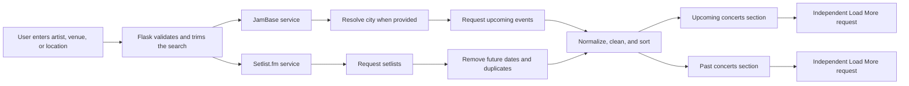
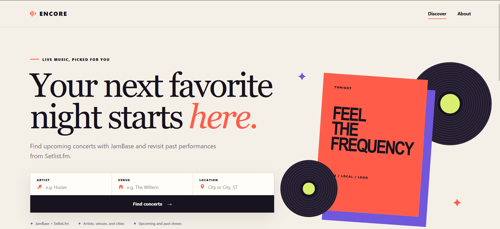
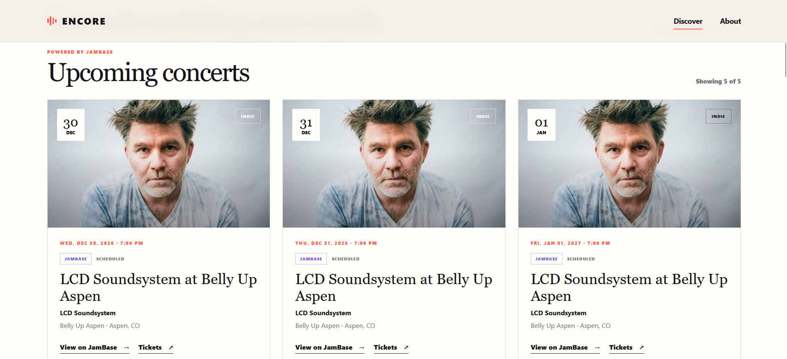
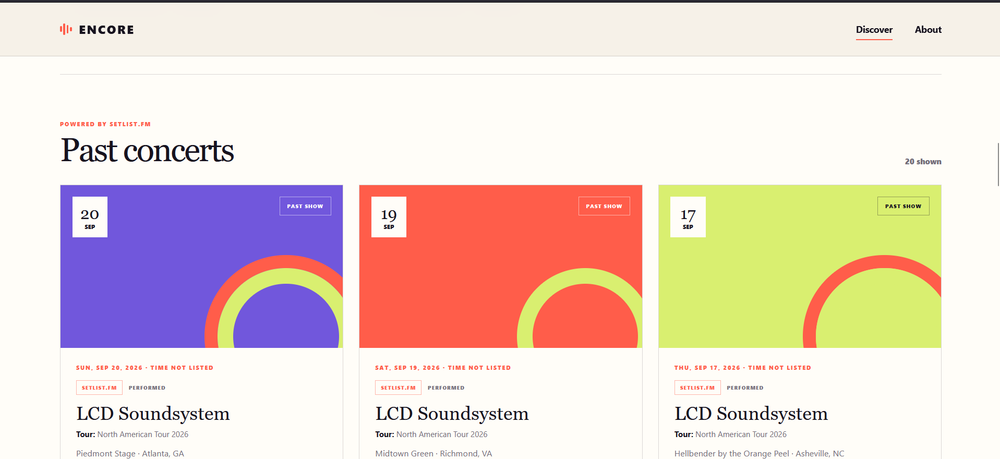
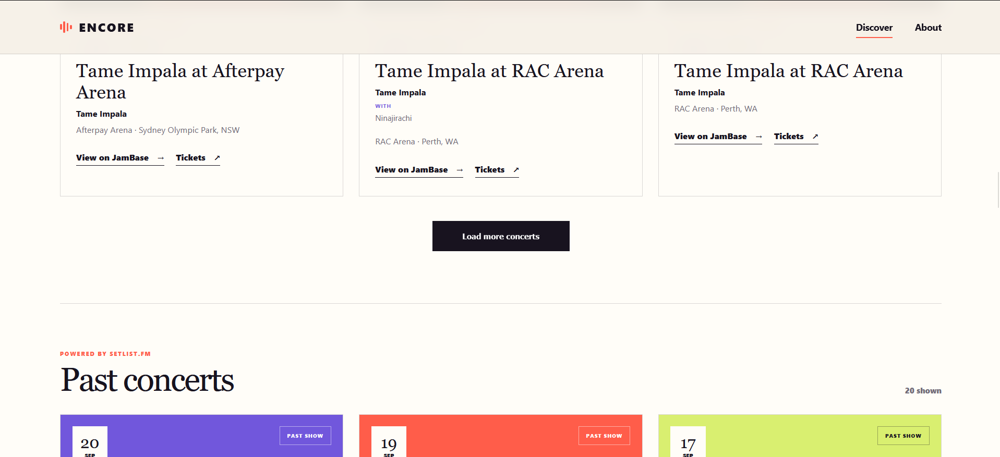

# Encore

**Student:** Hardik Katbamna<br>
**Course:** IT 401<br>
**Assignment:** A2 — Expanding the Web Intelligence Application Using an API

## Project Overview

Encore is a Flask concert-discovery application that combines live information from two external services. Users can search by artist, venue, and location from one interface. JamBase supplies upcoming concerts, artist images, venues, dates, and ticket links, while Setlist.fm supplies historical concert records. The application cleans both response formats into a shared event-card model but keeps upcoming and past concerts in separate sections so the results remain understandable.

Encore does not store concert data locally in A2. Search terms are submitted to the server, external data is requested on demand, normalized for presentation, and returned to the browser.

## External Information Sources

| Source | Endpoint(s) used | Purpose |
| --- | --- | --- |
| [JamBase Concert Data API](https://www.jambase.com/concert-api) | `GET https://api.data.jambase.com/v3/events` | Finds upcoming events by artist, venue, and resolved JamBase city identifier. Provides event names, dates, performers, images, status, venue details, attribution URLs, and ticket links. |
| JamBase Concert Data API | `GET https://api.data.jambase.com/v3/geographies/cities` | Resolves a city or `City, ST` search into the identifier required by the events endpoint. |
| [Setlist.fm API](https://api.setlist.fm/docs/1.0/index.html) | `GET https://api.setlist.fm/rest/1.0/search/setlists` | Finds historical performances by artist, venue, city, and optional state. Provides artist, tour, venue, location, event date, and Setlist.fm attribution URL. |

### Websites Scraped

No websites are scraped in the current version. An earlier concept considered scraping Setlist.fm, but the implementation uses its official API instead. Therefore, the application does not download HTML, parse page elements, or depend on a website's markup. This avoids fragile selectors and follows the source's supported access method.

## Application Workflow



The `/` route performs the initial search. JamBase and Setlist.fm are handled independently, so a failure from one source does not prevent the other source's results from appearing. Additional pages are requested asynchronously through `/api/events` and `/api/past-events` and appended to their respective result grids.

## Information Model

There is no persistent database in A2. The application uses transient Python dictionaries as a normalized view model.

| Entity | Important attributes | Origin and storage |
| --- | --- | --- |
| Search query | artist, venue, location, page | Local user input; held only for the current request and reflected in the page URL. |
| Normalized event | external ID, name, artist, date, time, venue, location, status, source, source URL | Created locally in memory from an external response; not persisted. |
| Artist/performer | name, headliner flag, genre, image, supporting artists | Externally acquired from JamBase and normalized locally. |
| Venue | name, city, state/region, country | Externally acquired from JamBase or Setlist.fm. |
| JamBase event | performers, start date, image, offers, event status, attribution URL | External API information used for upcoming concert cards. |
| Setlist record | artist, event date, tour, venue, city, attribution URL | External API information used for past concert cards. |
| Pagination state | current page, total items, next-page availability | Externally reported metadata interpreted locally for each source. |

Cleaning and normalization include date parsing, consistent date labels, state formatting, default labels for missing fields, artist-image fallback, headliner selection, supporting-act deduplication, festival-lineup truncation, Setlist.fm record deduplication by ID, and removal of invalid or non-past Setlist.fm dates.

## Environment Variables

Create a local `.env` file in the project root. The file is ignored by Git and must never be committed with real credentials.

```dotenv
JAMBASE_API_KEY=paste_your_jambase_api_key_here
SETLISTFM_API_KEY=paste_your_setlistfm_api_key_here
SECRET_KEY=replace_with_a_random_secret_for_production
FLASK_ENV=development
```

| Variable | Requirement | Description |
| --- | --- | --- |
| `JAMBASE_API_KEY` | Required for upcoming concerts | Sent as a bearer token to JamBase. |
| `SETLISTFM_API_KEY` | Required for past concerts | Sent to Setlist.fm in the `x-api-key` header. |
| `SECRET_KEY` | Recommended; required for a secure production deployment | Flask secret key. Development falls back to `dev`. |
| `FLASK_ENV` | Optional | Selects `development` or `production`; defaults to the development configuration. |
| `AI_SERVICE_API_KEY` | Optional and currently unused | Reserved by the starter project for a future service. |

## Installation Instructions

### Prerequisites

- Python 3.10 or newer
- Git
- JamBase and Setlist.fm API keys

### Setup

1. Clone the repository and enter it:

   ```bash
   git clone https://github.com/hkatbamna1/hkatbamna-IT401project.git
   cd hkatbamna-IT401project
   ```

2. Create a virtual environment:

   ```bash
   python -m venv .venv
   ```

3. Activate it on Windows PowerShell:

   ```powershell
   .venv\Scripts\Activate.ps1
   ```

   On macOS or Linux:

   ```bash
   source .venv/bin/activate
   ```

4. Install the required dependencies:

   ```bash
   python -m pip install -r requirements.txt
   ```

   The project depends on Flask, Requests, python-dotenv, and pytest.

5. Create `.env` in the project root and add the variables shown in [Environment Variables](#environment-variables). Replace the placeholders with your own API keys.

6. Start the application:

   ```bash
   python app.py
   ```

7. Open [http://127.0.0.1:5000](http://127.0.0.1:5000).

### Run the Tests

```bash
python -m pytest
```

## Current Features

- **API integration:** Retrieves upcoming concerts from JamBase and past performances from Setlist.fm.
- **Web scraping:** No scraping is performed; the official Setlist.fm API replaced the proposed scraper.
- **Search and filtering:** Combines artist, venue, and location filters. Locations accept a city or `City, ST`.
- **Separated results:** Upcoming and past concerts have distinct headings, cards, counts, and pagination controls.
- **Data cleaning:** Normalizes different API schemas, parses dates, selects headliners and images, deduplicates lineup and setlist records, limits oversized festival lineups, and excludes future Setlist.fm records.
- **Artist and lineup details:** Displays artist images when JamBase provides them, supporting acts without overflowing festival cards, and explicitly labeled Setlist.fm tour names.
- **Pagination:** Loads more results without replacing cards already on screen.
- **Responsive interface:** Provides desktop, tablet, and mobile layouts, including a compact results view after searching.
- **Source attribution:** Links every result back to JamBase or Setlist.fm and includes ticket links when JamBase supplies them.
- **Error handling:** Keeps source failures independent and gives users actionable messages or retry controls.
- **Automated testing:** Tests routes, normalization, filtering, API headers, missing credentials, pagination, and rendered source sections.

## Error Handling

| Failure | Application behavior |
| --- | --- |
| Missing JamBase API key | Displays an “Upcoming search unavailable” message explaining that `JAMBASE_API_KEY` must be added. Setlist.fm can still return past concerts. |
| Missing Setlist.fm API key | Displays a separate past-concert error explaining that `SETLISTFM_API_KEY` must be added. JamBase can still return upcoming concerts. |
| API timeout, HTTP error, or service outage | Catches Requests exceptions, logs the server-side failure, and shows a source-specific friendly message. Pagination endpoints return an error response and the button offers a retry. |
| Empty search form | Does not call either API and prompts the user to enter an artist, venue, or city. |
| Unknown or invalid city | Returns no JamBase events when the city cannot be resolved and suggests a broader or nearby location. |
| Invalid page value | Falls back to page 1; negative values are clamped to page 1. |
| Invalid or missing external fields | Uses safe defaults such as “Venue TBA,” “DATE TBA,” or “TIME NOT LISTED.” Invalid Setlist.fm dates are skipped. |
| No matching results | Shows a no-results message rather than an empty card grid. |
| Missing HTML elements | Not applicable to external acquisition because no HTML is scraped. Client-side pagination also checks for its target grid before attempting to append cards. |

## Ethical Considerations

- Each card identifies its source and links to the original JamBase or Setlist.fm page. Setlist.fm data is accompanied by its required attribution URL.
- Credentials remain server-side in `.env`; API keys are not rendered into HTML or committed to Git.
- Results are requested only in response to user searches. “Load more” uses explicit pagination instead of automatically downloading every available page, reducing unnecessary traffic and respecting rate limits.
- The application should remain within each provider's terms, quotas, and permitted use. Setlist.fm states that its free API is for non-commercial projects.
- No website is currently scraped. If scraping is added later, Encore should first verify that the site's terms and `robots.txt` permit it, use a descriptive user agent, throttle and cache requests, collect only necessary public information, and stop gracefully when markup changes.

## Known Limitations

- Concerts, searches, favorites, and user preferences are not saved between sessions.
- Results depend on external API availability, coverage, accuracy, quotas, and rate limits.
- There is no response cache, so repeating a search makes new external requests.
- Location search is city-based; radius, postal code, and current-location search are not implemented.
- Setlist.fm does not provide artist images or reliable start times for these records, so past cards use a graphic placeholder and may show “TIME NOT LISTED.”
- Historical coverage is limited to performances contributed to Setlist.fm, and future-dated Setlist.fm records are intentionally excluded.
- Search does not yet offer date-range, price, distance, or genre controls.
- The application has no authentication, saved favorites, personalized recommendations, or production database.
- External records are normalized in memory but are not reconciled across sessions.

## Screenshots

### Homepage



### API Results — Upcoming Concerts

JamBase API results with artist images, venue information, attribution, and ticket links.



### Historical Results — Setlist.fm

Setlist.fm API results filtered to past dates. No scraped HTML is used in the current implementation.



### Combined Interface

Upcoming JamBase results and past Setlist.fm results remain visually separated within the same search experience.



## Future Work — Assignment 3

A3 will add persistent storage so externally acquired information can be reused and connected to user activity.
